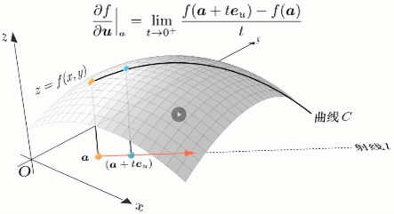
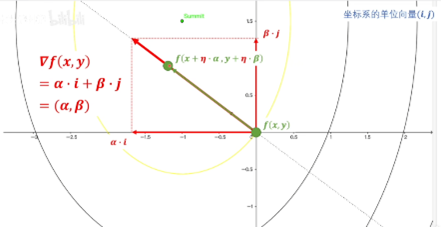
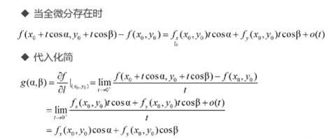
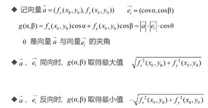
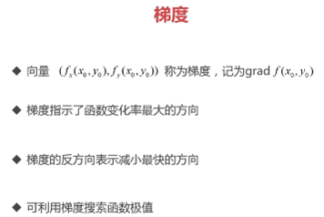
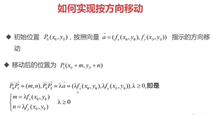
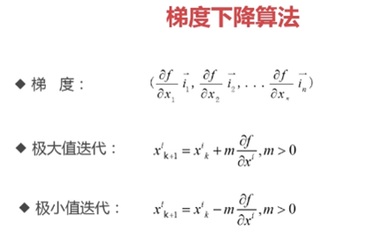

### .1 interpreter Python
+ 方向导数：https://www.bilibili.com/video/BV16S421X78A 
  
+ 方向导数平面投影：https://www.bilibili.com/video/BV1Zg411T71b 
 
  
### .2 推导
**(1)** 
   
**(2)** 
   
**(3)** 
   
**(4)** 
   
**(5)** 
   
**(6)** 
   
**(7)** 
   

