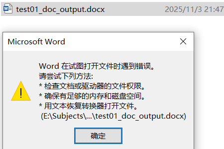

 251105 cursor Agent Auto
 
---
 @scores4_xlsx_items之下的文件“grd22yr24__何书松.xlsx”的sheet“成绩单copy”，第1行是表头，第2列的表头是“学号”，第3列的表头是“班级”。@scores1_raw 之下的文件“2022级学生基本信息 (1).xlsx”的第一个sheet“2022级学生基本信息”，第1行是表头，第1列的表头是“学号”，第9列的表头是“班级”。按如下过程通过学号进行关联查询：逐一查询“grd22yr24__何书松.xlsx”sheet“成绩单copy”的各行(表头行除外)，如果其“班级”为空字符串、""或None，就查该“学号”在“2022级学生基本信息 (1).xlsx”第一个sheet“2022级学生基本信息”的哪一行，如果找到在“2022级学生基本信息 (1).xlsx”sheet“2022级学生基本信息”的行 就找到了“班级”信息，将这个“班级”信息写入该学号在“grd22yr24__何书松.xlsx”sheet“成绩单copy”所在行的“班级”列中，还要请你想办法验证这个过程是否正确。所有文件名、sheet名称均用参数表示，方便函数重用，如果能采用类似数据库关联查询的方法实现更好，将代码写入@8_4_scores__update_class.py

---

@8_4_scores__update_class.py 正确。 请看历史会话记录，但要做如下改进：(1) 依据学号id在源文件source_file的source_sheet找到该学号id的班级class信息在写入target_file的target_sheet对应学号id的班级class时，可以在调用函数中指明字体颜色（比如红色）。(2)在打开备份backup文件时，出现如附件图片所示的提示框信息，打不开。——为此，请你改进@8_4_scores__update_class.py，与(1) (2)两个问题不相关的地方 不要修改 因为代码基本是正确的， 我已修改了@8_4_scores__update_class.py 中source、target的文件名或sheet名 按此修改调试程序。

---

@8_4_scores__update_class.py 代码正确，但是target文件的sheet被写入“班级class”信息后，即@8_4_scores__update_class.py 运行之后，target文件sheet的“学号id”显示成了科学计数法，需要保留为原来的形式，其他的所有列也有保留原来的显示格式。——请修改@8_4_scores__update_class.py ，与前述问题不相关的代码不要修改，以@8_4_scores__update_class.py 中当前的target、source文件及sheet变量值进行修改调试。

---

@8_4_scores__update_class.py 代码正确，但是target文件的sheet被写入“班级class”信息后，即@8_4_scores__update_class.py 运行之后，target文件所有列也要保留原来的显示样式，比如，原来是“为文本形式存储的数字”依然保留为“为文本形式存储的数字”，即写入信息时不要影响其他数据及其显示样式。——请修改@8_4_scores__update_class.py，与前述问题不相关的代码不要修改，以@8_4_scores__update_class.py 中当前的target、source文件及sheet变量值进行修改调试。

---

打开备份文件backup时，出现如附件图片所示的错误。就这个一个问题，@8_4_scores__update_class.py 中与此无关的代码不要修改。按当前target、source文件及sheet变量值进行代码修改调试。

--

运行完代码后，即更新完班级信息后，target文件sheet的有的列（如学号id列）列宽改变了，请不要修改所有列的列宽、不要修改所有行的行高，请你检查代码@8_4_scores__update_class.py，若能找到问题所在 就修改。