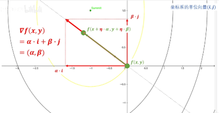
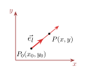
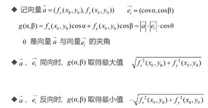
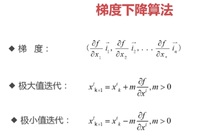

### .1 
+ 方向导数：https://www.bilibili.com/video/BV16S421X78A 
  
+ 方向导数平面投影：https://www.bilibili.com/video/BV1Zg411T71b 
 

---

### .2 推导
**(1) 射线的参数方程** 
<!--     -->

* 单位方向向量 $\vec{e_l} = (\cos\alpha, \cos\beta)$ ，射线以 $P_0(x_0, y_0)$ 为起点，且与 $\vec{e_l}$ 同向，求射线的参数方程

* 设射线上的点为 $P(x, y)$

$$
\overrightarrow{P_0P} = (x - x_0, y - y_0), \overrightarrow{P_0P} = t\vec{e_l}, t \ge 0, \text{即是}
$$

$$
\begin{cases}
x = x_0 + t\cos\alpha \\
y = y_0 + t\cos\beta
\end{cases}
\quad t \ge 0
$$

$$
|\vec{e_l}| = \sqrt{\cos^2\alpha + \cos^2\beta} = 1
$$

---

**(2) 变化率函数** 
<!--     -->
* 通过 $\alpha, \beta$ 表示方向，是 $\alpha, \beta$ 的函数，记为

$$
g(\alpha, \beta) = \left.\frac{\partial f}{\partial l}\right|_{(x_0, y_0)} = \lim_{t \to 0^+} \frac{f(x_0 + t\cos\alpha, y_0 + t\cos\beta) - f(x_0, y_0)}{t}
$$

* $g(\alpha, \beta)$ 的最大值表示函数在某个方向上的具有最大变化率
  
**(3)** 
<!--     -->
* 当全微分存在时

$$
f(x_0 + t\cos\alpha, y_0 + t\cos\beta) - f(x_0, y_0) = f_x(x_0, y_0)t\cos\alpha + f_y(x_0, y_0)t\cos\beta + o(t)
$$

* 代入化简

$$
\begin{aligned}
g(\alpha, \beta) &= \left.\frac{\partial f}{\partial l}\right|_{(x_0, y_0)} = \lim_{t \to 0^+} \frac{f(x_0 + t\cos\alpha, y_0 + t\cos\beta) - f(x_0, y_0)}{t} \\
&= \lim_{t \to 0^+} \frac{f_x(x_0, y_0)t\cos\alpha + f_y(x_0, y_0)t\cos\beta + o(t)}{t} \\
&= f_x(x_0, y_0)\cos\alpha + f_y(x_0, y_0)\cos\beta
\end{aligned}
$$

---

**(4) 变化率最大值** 
<!--     -->
* 记向量 $\vec{a} = (f_x(x_0, y_0), f_y(x_0, y_0))$, $\vec{e_l} = (\cos\alpha, \cos\beta)$
  $g(\alpha, \beta) = f_x(x_0, y_0)\cos\alpha + f_y(x_0, y_0)\cos\beta = |\vec{a}|\cdot|\vec{e_l}|\cdot\cos\theta$
  $\theta$ 是向量 $\vec{a}$ 与向量 $\vec{e_l}$ 的夹角
* $\vec{a}$、$\vec{e_l}$ 同向时, $g(\alpha, \beta)$ 取得最大值 $\sqrt{f_x^2(x_0, y_0) + f_y^2(x_0, y_0)}$
* $\vec{a}$、$\vec{e_l}$ 反向时, $g(\alpha, \beta)$ 取得最小值 $-\sqrt{f_x^2(x_0, y_0) + f_y^2(x_0, y_0)}$
  
**(5) 梯度** 
<!--     -->
* 向量 $(f_x(x_0, y_0), f_y(x_0, y_0))$ 称为梯度，记为 $\text{grad } f(x_0, y_0)$
* 梯度指示了函数变化率最大的方向
* 梯度的反方向表示减小最快的方向
* 可利用梯度搜索函数极值

---

**(6) 如何实现按方向移动** 
<!--     -->
* 初始位置 $P_0(x_0, y_0)$，按照向量 $\vec{a} = (f_x(x_0, y_0), f_y(x_0, y_0))$ 指示的方向移动

* 移动后的位置为 $P_1(x_0 + m, y_0 + n)$

$$
\overrightarrow{P_0P_1} = (m, n), \overrightarrow{P_0P_1} = \lambda\vec{a} = (\lambda f_x(x_0, y_0), \lambda f_y(x_0, y_0)), \lambda \ge 0, \text{即是}
$$

$$
\begin{cases}
m = \lambda f_x(x_0, y_0) \\
n = \lambda f_y(x_0, y_0)
\end{cases}
\quad \lambda \ge 0
$$

**(7) 梯度下降算法** 
<!--     -->

* 梯 度：
$$
\left(\frac{\partial f}{\partial x_1}\vec{i}_1, \frac{\partial f}{\partial x_2}\vec{i}_2, \ldots, \frac{\partial f}{\partial x_n}\vec{i}_n\right)
$$

* 极大值迭代：
$$
x_{k+1}^i = x_k^i + \lambda \frac{\partial f}{\partial x^i}, \lambda > 0
$$

* 极小值迭代：
$$
x_{k+1}^i = x_k^i - \lambda \frac{\partial f}{\partial x^i}, \lambda > 0
$$

