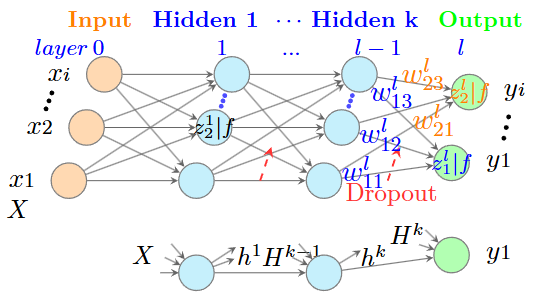
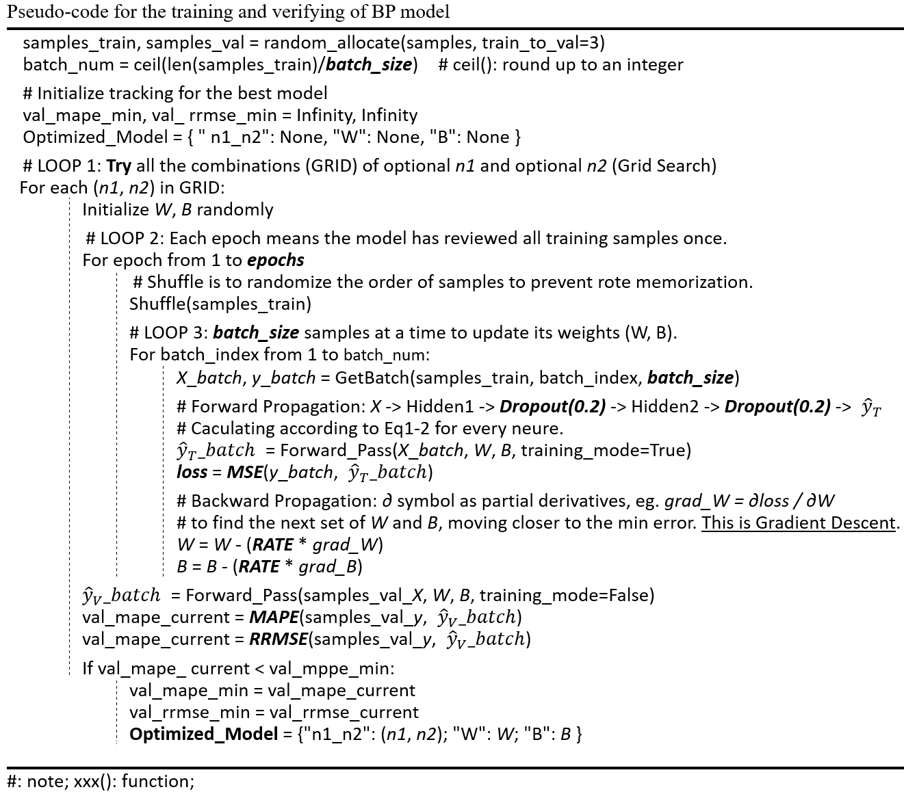

**BP**: Back propagation neural network

### 符号说明
* **$l$**: 表示当前神经网络的层数。
* **$w$**: 权重 (Weights)。
* **$h$**: 隐藏层输出/激活值 (Hidden states/Activations)，其中 $h^{l-1}$ 是上一层的输出。
* **$b$**: 偏置 (Bias)。
* **$z$**: 线性加权和（未经过激活函数）。
* **$f$**: 激活函数 (Activation function)。

---

### .1 正向传播 Forward Propagation

- 线性加权和
$
{\small
\begin{aligned}
z_1^l = w_{11}^l h_1^{l-1} + \dots + w_{13}^l h_3^{l-1} + b_1^l\\
z_2^l = w_{21}^l h_1^{l-1} + \dots + w_{23}^l h_3^{l-1} + b_2^l
\end{aligned}
}
$
 

  矩阵形式表示 (Vectorized Form)
$
{\small
\begin{aligned}
\begin{bmatrix} z_1^l \\ z_2^l \end{bmatrix} = \begin{bmatrix} w_{11}^l, w_{12}^l, w_{13}^l \\ w_{21}^l, w_{22}^l, w_{23}^l \end{bmatrix} \begin{bmatrix} h_1^{l-1} \\ h_2^{l-1} \\ h_3^{l-1} \end{bmatrix} + \begin{bmatrix} b_1^l \\ b_2^l \end{bmatrix}
\end{aligned}
}
$
 

- 激活函数$f$
$
{\small
\begin{aligned}
h_1^l = f(z_1^l) \quad h_2^l = f(z_2^l)
\end{aligned}
}
$
 

- 通用的层级向量化公式
$
{\small
\begin{aligned}
h_i^l &= f\left(\sum_j w_{ij}^l h_j^{l-1} + b_i^l\right) = f(z(H^{l-1}))\\
H^l &= f(W^l H^{l-1} + B^l)
\end{aligned}
}
$
注：向量化写法，一般是加粗字母符号，我这里用大写字母表示。

---

### .2 $loss$函数反向传播求偏导 Back propagation

#### (1). 损失函数$loss$ (Loss Function)

使用均方误差 (MSE) 作为损失函数：
$
{\small
\begin{aligned}
L = Loss = \frac{1}{2} \sum_{i=1}^2 (y_i - h_i^l)^2
\end{aligned}
}
$
*(注：$y$ 为真实值；$h$正向计算预测值，也记作$\hat{y}$)*

#### (2). 定义中间量 $\delta^l = \frac{\partial L}{\partial z^l}$ (Error Term)
对于输出层神经元 1：
$
{\small
\begin{aligned}
\delta_1^l = \frac{\partial L}{\partial z_1^l}&= \frac{\partial L}{\partial h_1^l} \cdot \frac{\partial h_1^l}{\partial z_1^l} \\ 
&= \frac{\partial [\frac{1}{2}(y_1 - h_1^l)^2]}{\partial h_1^l} \cdot \frac{\partial h_1^l}{\partial z_1^l} \\
&\quad \color{red}{\text{（}\frac{1}{2} \sum_{i≠1}^2 (y_i - h_i^l)^2 \text{ 对于 } h_1^l \text{ 为已知，对}h_1^l的偏导为0）}\\
&= \frac{\partial [\frac{1}{2}(h_1^l)^2-y_1·h_1^l +\frac{1}{2}y_1^2]}{\partial h_1^l} \cdot \frac{\partial h_1^l}{\partial z_1^l}\\  
&= (h_1^l - y_1) \cdot \frac{\partial h_1^l}{\partial z_1^l} \\ 
&= (h_1^l - y_1) \cdot f'(z_1^l)
\end{aligned}
}
$

对于输出层神经元 2：
$
{\small
\begin{aligned}
\delta_2^l = (h_2^l - y_2) \cdot f'(z_2^l)
\end{aligned}
}
$

**$\delta$的称呼：**

- Error Term（最常用）这是最标准的学术称呼，直译为**误差项**。它代表了损失函数 $L$ 对神经元线性输入 $z$ 的响应程度。
  
- Sensitivity翻译为**敏感度**。这个名称非常形象地描述了 $\delta$ 的数学本质：神经元输入 $z$ 的微小变化对最终输出损失 $L$ 的影响程度（即导数），即：如果微调该神经元的加权输入 $z$，损失函数 $L$ 会发生多大的变化。**$\delta$ 的物理意义是：该神经元对最终总误差贡献了多少**。
  
- Local Gradient翻译为**局部梯度**。在反向传播的链式法则中，每一层的 $\delta$ 都是该位置特有的梯度分量，用于进一步计算权重 $w$ 的梯度。
  
- Delta在讨论 BP（Backpropagation）算法时，由于该符号本身就是希腊字母 $\delta$，开发者和研究者也经常直接称其为 **The Delta term**。

#### (3) $loss$ 对偏置 $b$ 的偏导
$
{\small
\begin{aligned}
\frac{\partial L}{\partial b_1^l} &= \frac{\partial L}{\partial z_1^l} \cdot \frac{\partial z_1^l}{\partial b_1^l} = \delta_1^l \cdot 1 = \delta_1^l\\
\frac{\partial L}{\partial b_2^l} &= \delta_2^l
\end{aligned}
}
$

#### (4) $loss$ 对权重 $w$ 的偏导
$
{\small
\begin{aligned}
\frac{\partial L}{\partial w_{11}^l} &= \frac{\partial L}{\partial z_1^l} \cdot \frac{\partial z_1^l}{\partial w_{11}^l} = \delta_1^l \cdot h_1^{l-1} \\
\frac{\partial L}{\partial w_{12}^l} &= \frac{\partial L}{\partial z_1^l} \cdot \frac{\partial z_1^l}{\partial w_{12}^l} = \delta_1^l \cdot h_2^{l-1} \\
\frac{\partial L}{\partial w_{23}^l} &= \frac{\partial L}{\partial z_2^l} \cdot \frac{\partial z_2^l}{\partial w_{23}^l} = \delta_2^l \cdot h_3^{l-1}
\end{aligned}
}
$

向量化写法：
$
{\small
\begin{aligned}
\frac{\partial L}{\partial W^{l}} = \boldsymbol{\delta}^{l} (H^{l-1})^T
\end{aligned}
}
$

#### (5) $\delta^{l-1} = \frac{\partial L}{\partial z^{l-1}}$ 
$
{\small
\begin{aligned}
\delta_1^{l-1} &= \frac{\partial L}{\partial z_1^{l-1}} = \frac{\partial L}{\partial z_1^l} \cdot \frac{\partial z_1^l}{\partial z_1^{l-1}} \\ &= \delta_1^l \cdot \frac{\partial z_1^l}{\partial h_1^{l-1}} \cdot \frac{\partial h_1^{l-1}}{\partial z_1^{l-1}} \\ &= \delta_1^l \cdot w_{11}^l \cdot f'(z_1^{l-1})\\
\\
\delta_3^{l-1} &= \frac{\partial L}{\partial z_3^{l-1}} = \frac{\partial L}{\partial z_1^l} \cdot \frac{\partial z_1^l}{\partial z_3^{l-1}} \\ &= \delta_1^l \cdot \frac{\partial z_1^l}{\partial h_3^{l-1}} \cdot \frac{\partial h_3^{l-1}}{\partial z_3^{l-1}} \\ &= \delta_1^l \cdot w_{13}^l \cdot f'(z_3^{l-1})
\end{aligned}
}
$

**矩阵向量化表示：**

$
{\small
\begin{aligned}
\boldsymbol{\delta}^{l-1} = (W^l)^T \boldsymbol{\delta}^l \odot f'(Z^{l-1})
\end{aligned}
}
$

* **$\boldsymbol{\delta}^{l-1}$**：第 $l-1$ 层的误差项向量（Error Term Vector），代表损失函数对该层线性输出 $Z^{l-1}$ 的偏导数。
* **$(W^l)^T$**：第 $l$ 层权重矩阵的**转置**。
* **$\boldsymbol{\delta}^l$**：第 $l$ 层（下一层）已计算出的误差项向量。
* **$\odot$**：**Hadamard 积**（元素对应相乘 / Element-wise product）。
* **$f'(Z^{l-1})$**：第 $l-1$ 层激活函数对线性输入 $Z$ 的导数。

维度对齐验证
* 设 $l$ 层有 $n$ 个神经元，$l-1$ 层有 $m$ 个神经元。
* $\boldsymbol{\delta}^l$ 维度为 $(n \times 1)$。
* $W^l$ 维度为 $(n \times m)$，其转置 $(W^l)^T$ 维度为 $(m \times n)$。
* 矩阵乘法 $(m \times n) \cdot (n \times 1)$ 结果为 $(m \times 1)$。
* 这正好与 $f'(Z^{l-1})$ 的 $(m \times 1)$ 维度匹配，从而可以进行 Hadamard 积运算。

#### (6) 反向传播逻辑流

$
{
\begin{aligned}
L \to \delta^l \to \delta^{l-1} \to \dots
\end{aligned}
}
$
$
{
\begin{aligned}
\quad \quad \Downarrow \quad \quad \Downarrow
\end{aligned}
}
$
$
{\small
\begin{aligned}
\frac{\partial L}{\partial w^l}, \frac{\partial L}{\partial b^l} \quad \frac{\partial L}{\partial w^{l-1}}, \frac{\partial L}{\partial b^{l-1}}
\end{aligned}
}
$
 

$
{\small
\begin{aligned}
\frac{\partial L}{\partial w_{11}^{l-1}} &= \frac{\partial L}{\partial z_1^{l-1}} \cdot \frac{\partial z_1^{l-1}}{\partial w_{11}^{l-1}} = \delta_1^{l-1} \cdot h_1^{l-2} \\
% \frac{\partial L}{\partial w_{12}^{l-1}} &= \frac{\partial L}{\partial z_1^{l-1}} \cdot \frac{\partial z_1^{l-1}}{\partial w_{12}^{l-1}} = \delta_1^{l-1} \cdot h_2^{l-2} \\
\frac{\partial L}{\partial w_{23}^{l-1}} &= \frac{\partial L}{\partial z_2^{l-1}} \cdot \frac{\partial z_2^{l-1}}{\partial w_{23}^{l-1}} = \delta_2^{l-1} \cdot h_3^{l-2}
\end{aligned}
}
$

向量化写法：
$
{\small
\begin{aligned}
\frac{\partial L}{\partial W^{l-1}} = \boldsymbol{\delta}^{l-1} (H^{l-2})^T
\end{aligned}
}
$

**得到所有的**
$
{\small
\begin{aligned}
\frac{\partial L}{\partial w}, \frac{\partial L}{\partial b}
\end{aligned}
}
$ 
然后，
通过梯度下降公式**更新所有的$w,b$**，
进入**下一轮**正向传播、反向传播。

循环之前的 $w,b$ 初始值为假定的随机值。

---
### .3 BP及其训练-验证伪代码

#### (1) 模型是什么
- 神经网络结构(层数及每层的神经元数量), 称为超参数；
- 所有的$w$和$w$，称为参数；
- 网状结构和激活函数$f$实现了非线性；
- 基于数据驱动模型，并不是基于物理机理，虽然可以体现某些因素$x$的影响规律;
- 自变量$X$是影响因素，称为特征值$features$；因变量$y$称为标签$label$。

#### (2) 伪代码

---

### .4 激活函数$f$及其导数

#### (1) Sigmoid 激活函数及其导数

**A. $\frac{d}{du} e^u = e^u$**

自然常数 $e$ 的定义之一就是确保:
$
{\small
\begin{aligned}
\lim_{x \to 0} \frac{e^x - 1}{x} = 1
\end{aligned}
}
$

故：
$
{\small
\begin{aligned}
\lim_{x \to 0} \frac{e^x - 1}{x} = 1
\end{aligned}
}
$

现在，根据导数极限定义：
$
{\small
\begin{aligned}
\frac{d}{du} e^u = \lim_{\Delta u \to 0} \frac{e^{u+\Delta u} - e^u}{\Delta u} = e^u \cdot \lim_{\Delta u \to 0} \frac{e^{\Delta u} - 1}{\Delta u} = e^u
\end{aligned}
}
$

**B. 复合指数函数 $e^{-x}$ 的求导**
设 $u = -x$，利用链式法则：
$
{\small
\begin{aligned}
\frac{d}{dx}(e^{-x}) = \frac{d}{du}(e^u) \cdot \frac{du}{dx} = e^u \cdot (-1) = -e^{-x}
\end{aligned}
}
$

**C. Sigmoid函数求导**

$
{\small
\begin{aligned}
f(x) &= \frac{1}{1 + e^{-x}}\\
&=(1 + e^{-x})^{-1}\\
\end{aligned}
}
$

$
{\small
\begin{aligned}
f'(x)
&= -1 \cdot (1 + e^{-x})^{-2} \cdot \frac{d}{dx}(1 + e^{-x})\\
&= -1 \cdot (1 + e^{-x})^{-2} \cdot (-e^{-x}) \\
&= \frac{e^{-x}}{(1 + e^{-x})^2}\\
&= \frac{1 + e^{-x} - 1}{(1 + e^{-x})^2}\\
&= \frac{1 + e^{-x}}{(1 + e^{-x})^2} - \frac{1}{(1 + e^{-x})^2} \\
&= \frac{1}{1 + e^{-x}} - \left( \frac{1}{1 + e^{-x}} \right)^2
\end{aligned}
}
$

由于 $f(x) = \frac{1}{1 + e^{-x}}$，代入上式得：
$
{\small
\begin{aligned}
f'(x) = f(x) - f(x)^2
\end{aligned}
}
$
**即：**
$
{\small
\begin{aligned}
f' = f*(1 - f)
\end{aligned}
}
$

#### (2) 其他激活函数

略

---